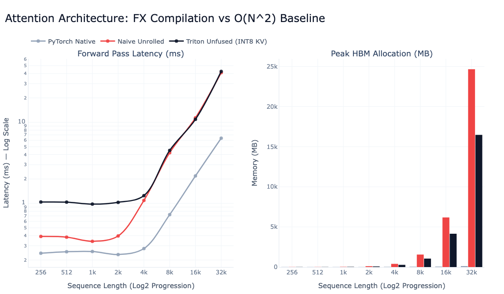

# KV Cache Quantization with Graph Compilation and Kernel Fusion

## Project Overview
This project explores model quantization with custom compiler engineering to optimize Large Language Model (LLM) inference. The primary objective is to implement an INT8 KV-Cache compression pipeline that mathematically mirrors standard Attention while significantly reducing the High Bandwidth Memory (HBM) footprint at long context windows (up to 32,768 tokens).

By leveraging PyTorch FX for Abstract Syntax Tree (AST) graph rewriting and OpenAI Triton for custom GPU kernel compilation, the architecture intercepts PyTorch's native execution graph, quantizes the KV cache dynamically, and fuses the dequantization step directly into an SRAM-tiled Flash Attention V2 kernel.

---

## Architectural States & Methodology

The project was developed across three distinct architectural states. Each state isolates a specific performance variable to demonstrate why isolated optimizations fall short.

### 1. Simple Attention Baseline
The foundational baseline utilizes a mathematically unrolled, eager-mode PyTorch implementation of Multi-Head Attention.
* **The "Why":** Standard attention materializes the $N \times N$ score matrix in HBM. This has a massive memory footprint on the HBM, making it memory-bound.

### 2. Unfused INT8 Quantization
In this state, the $K$ and $V$ tensors are successfully quantized to INT8, but they are dequantized back to FP16 in Eager mode immediately prior to the $O(N^2)$ dot product. There is a kernel fusion of dequantization with the next operation to prevent FP16 intermediates from getting written to the HBM.
* **The "Why":** This state isolates the variable of memory capacity. It proves that merely compressing the KV cache by 50% does not solve the long-context bottleneck. The intermediate score matrix ($Q \times K^T$) still explodes to ~16.4 GB at a 32k sequence length. This validates that quantization is ineffective for long contexts unless coupled with algorithmic block-tiling (Flash Attention).

### 3. Fused INT8 Flash Attention V2
The final architecture deploys a custom `torch.fx` compiler pass that hunts down the attention subgraphs, injects INT8 quantization nodes, and replaces the entire attention mathematical block with a custom Triton kernel.
* **The "Why":** By utilizing Triton, the kernel loads INT8 $K$ and $V$ blocks directly into the A100's ultra-fast SRAM, applies the scalar dequantization within the thread registers, and calculates the online softmax without ever writing the FP16 cache or the $O(N^2)$ matrix back to HBM. This achieves both the memory benefits of quantization and the algorithmic advantages of Flash Attention, ensuring that the HBM usage has reduced compared to PyTorch Native `nn.MultiHeadAttention`, at the cost of minimal forward latency.

---

## Experimental Results

The architecture was benchmarked on an NVIDIA A100 GPU across sequence lengths ranging from 256 to 32,768 tokens.

### State 2 — Unfused INT8 Quantization
Benchmarking the unfused INT8 pipeline against the Naive Unrolled baseline and PyTorch Native SDPA demonstrates that quantization alone does not resolve the $O(N^2)$ memory bottleneck.

| Sequence Length | Naive Unrolled (MB) | PyTorch Native (MB) | Triton Unfused INT8 (MB) |
| :--- | :--- | :--- | :--- |
| **4k** | 403.16 | 25.16 | 277.16 |
| **8k** | 1563.16 | 39.16 | 1055.16 |
| **16k** | 6187.16 | 67.16 | 4147.16 |
| **32k** | 24651.16 | 123.16 | 16475.16 |

**Observation:** Even with INT8 KV compression, the Unfused pipeline still materialises the full $O(N^2)$ score matrix in HBM — peaking at **16,475 MB** at 32k tokens, far exceeding the Native PyTorch baseline. This confirms quantization is ineffective without tiled Flash Attention.



---

### State 3 — Fused INT8 Flash Attention V2
The fused Triton kernel eliminates the $O(N^2)$ materialisation entirely, achieving meaningful HBM reductions even compared to the optimised PyTorch Flash Attention backend.

#### Peak HBM Allocation

| Sequence Length | PyTorch Native (MB) | Pure Triton FA V2 (MB) | Fused INT8 Flash (FX) (MB) |
| :--- | :--- | :--- | :--- |
| **4k** | 25.16 | — | **21.16** |
| **8k** | 39.16 | — | **31.16** |
| **16k** | 67.16 | — | **51.16** |
| **32k** | 123.16 | — | **91.16** |

**Observation:** At 32,768 tokens, the Fused INT8 Flash architecture reduces peak HBM to **91.16 MB** — a **~26% reduction** versus PyTorch Native SDPA (123.16 MB).

#### Forward Pass Latency Tradeoff
On-the-fly dequantization inside the inner tile loop introduces compute overhead relative to a pure FP16 Flash Attention.

| Sequence Length | PyTorch Native (ms) | Pure Triton FA V2 (ms) | Fused INT8 Flash (FX) (ms) |
| :--- | :--- | :--- | :--- |
| **4k** | 0.27 | 0.58 | **0.87** |
| **8k** | 0.72 | 0.86 | **1.50** |
| **16k** | 2.17 | 2.82 | **4.80** |
| **32k** | 8.14 | 7.89 | **12.96** |

**Observation:** The INT8 cache introduces a latency penalty of roughly **1.6×** vs PyTorch Native at 32k context (12.96 ms vs 8.14 ms), in exchange for the 26% absolute memory reduction per layer.

.png)

---

## Insights

1. **The Compute vs. Bandwidth Ceiling:** While quantization strictly halves the memory bandwidth required to fetch the KV blocks ($1$ byte vs $2$ bytes per element), the latency results indicate the kernel becomes compute-bound by the dequantization arithmetic. In production serving deployments (e.g., vLLM), sacrificing ~5 ms of forward latency per attention layer is highly acceptable when the 26% capacity reduction enables serving substantially larger batches concurrently.

---

## Implementation Details

### Project Structure

```
KV-cache-quantization/
├── main.py                        # CLI entry point — runs benchmarks
├── src/
│   ├── models/
│   │   └── attention.py           # NaiveMultiHeadAttentionBatched (FX trace target)
│   ├── quantization/
│   │   └── quant_ops.py           # INT8 quantize/dequantize + unfused baseline
│   ├── kernels/
│   │   ├── flash_attention_v2.py  # Pure Triton Flash Attention V2 (FP16)
│   │   └── int8_flash_attn.py     # Fused INT8 KV Flash Attention V2 Triton kernel
│   ├── compiler/
│   │   └── fx_pass.py             # torch.fx graph rewriting pass
│   └── benchmark/
│       └── run_benchmark.py       # Benchmark harness + Plotly visualisation
└── Quantized_KV_compilation.ipynb # Original research notebook
```

### Dependencies

```
torch >= 2.0
triton >= 3.0
pandas
plotly
```

Install dependencies:

```bash
pip install torch triton pandas plotly
```

> **Note:** Triton and CUDA kernels require an NVIDIA GPU. The benchmark was validated on an A100 with CUDA 12.x.

### How to Run

Run both benchmark settings (O(N²) baseline comparison **and** Flash Attention comparison):

```bash
python main.py
```

Run only the O(N²) baseline comparison (PyTorch Native vs Naive Unrolled vs Triton Unfused INT8):

```bash
python main.py --setting original
```

Run only the Flash Attention comparison (PyTorch Native vs Pure Triton FA V2 vs Fused INT8 Flash FX):

```bash
python main.py --setting flash
```

Each run prints a summary table and opens an interactive Plotly chart showing forward-pass latency and peak HBM allocation across sequence lengths from 256 to 32,768 tokens.

---

### AST Manipulation Pipeline

The compiler graph rewriting is achieved via `torch.fx.symbolic_trace`, capturing the AST and injecting the Triton kernel transparently.

The `torch.fx` pass in [`src/compiler/fx_pass.py`](src/compiler/fx_pass.py) executes in three primary phases to safely rewrite the graph without breaking topological constraints:

1. **Subgraph Isolation (Pattern Matching):** The compiler iterates through the AST to locate a highly specific anchor: a `torch.matmul` node dependent on a `torch.softmax` node. From this anchor, it performs a reverse graph traversal to isolate the Query, Key, and Value nodes regardless of the surrounding model architecture.
2. **Topological Injection & Rerouting:** Utilizing `inserting_before` and `inserting_after` context managers, the compiler injects the INT8 quantization nodes and the custom Triton kernel into the exact topological execution order. `replace_all_uses_with` then reroutes all downstream layers to consume the new Triton output.
3. **Acyclic Dead Code Elimination (DCE):** The original downstream consumers (`original_users`) are cached before any rerouting occurs. Finally, the orphaned native PyTorch $O(N^2)$ nodes are explicitly erased in reverse topological order, ensuring no active dependencies are broken during cleanup.

```python
# Example of the FX Graph Rewriting injection pass
with symbolic_traced.graph.inserting_after(quantized_v):
    triton_node = symbolic_traced.graph.call_function(
        fx_flash_attn_v2_wrapper,
        args=(att_block["q"], quantized_k, quantized_v)
    )
att_block["final_out"].replace_all_uses_with(triton_node)
```